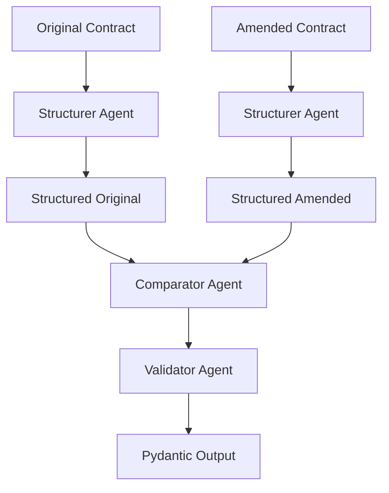
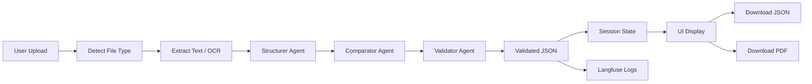

# 📄 LegalMove – Autonomous Contract Comparison System (PRO)

## Overview
LegalMove is an AI-powered Streamlit application designed for **automated legal contract comparison** between an original agreement and its amended version.

The system leverages **GPT-4o Vision + multi-agent architecture** to:
- Extract text from PDFs and images
- Structure contracts into clauses
- Detect and analyze legal changes
- Validate outputs with strict schemas
- Provide **downloadable reports (JSON + PDF)**

Additionally, it includes **token tracking, cost estimation, and observability via Langfuse**.

---

## 🚀 Key Features

### 🔍 Document Upload & Parsing
- Supports:
  - **PDFs (multi-page)**
  - **Images (JPG, PNG, JPEG)**
- Uses **PyMuPDF** to extract text from PDFs
- Falls back to **GPT-4o Vision OCR** when text is not extractable
- Image-based parsing via base64 encoding

---

### 🧠 Multi-Agent System

#### 🧩 Agent 1 – Contract Structurer
- Breaks contracts into clauses
- Assigns:
  - Clause IDs
  - Titles
  - Structured text blocks

#### ⚖️ Agent 2 – Contract Comparator
- Compares structured contracts
- Detects:
  - Added clauses
  - Removed clauses
  - Modified clauses
- Outputs legal impact:
  - low / medium / high

#### ✅ Agent 3 – Pedantic Validator (NEW)
- Ensures strict JSON compliance
- Fixes malformed outputs
- Adds:
  - `total_changes`
- Guarantees production-ready schema

---

### 🧱 Pydantic Validation Layer
All outputs are validated using Pydantic:

- Enforces schema integrity
- Prevents malformed responses
- Ensures safe downstream usage (APIs / DB / pipelines)

---

### 📊 Token Tracking & Cost Estimation (NEW)
Tracks OpenAI usage:

- Input tokens
- Output tokens
- Total tokens
- Estimated USD cost

Useful for:
- Optimization
- Scaling decisions
- Monitoring LLM spend

---

### 📈 Langfuse Observability
Integrated tracing across:

- OCR / Vision parsing
- Agent executions
- Validation stage
- Final output

Enables:
- Debugging
- Prompt evaluation
- Performance tracking

---

### 💾 Export & Persistence (NEW)

#### 📥 Download Options
Users can export results as:

- **JSON** → structured, API-ready output  
- **PDF** → human-readable legal report  

#### 🧠 Session State Persistence
- Results persist across interactions
- Prevents re-computation on download
- Enables multiple downloads without losing data

---

## 🧾 Output Format

### JSON Output
```json
{
  "total_changes": 3,
  "modified_clauses": [
    {
      "clause_id": "4",
      "original_text": "...",
      "amended_text": "...",
      "change_type": "modified",
      "legal_impact": "high"
    }
  ],
  "affected_topics": ["termination", "liability"],
  "summary": "..."
}
```

---

## 🏗️ System Architecture Diagram

```mermaid
graph TD
    A[Streamlit UI] --> B[File Upload]
    B --> C[PDF Parsing (PyMuPDF)]
    C --> D[Fallback: GPT-4o Vision OCR]
    D --> E[Agent 1 - Structurer]
    E --> F[Agent 2 - Comparator]
    F --> G[Agent 3 - Validator]
    G --> H[Pydantic Validation]
    H --> I[Session State Storage]
    I --> J[UI Display]
    J --> K[Download JSON/PDF]
    G --> L[Langfuse Logging]
```

---

## 🔄 Agent Workflow



---

## 🔁 End-to-End Flow



---

## ⚙️ Installation

### 1. Create environment
```bash
python -m venv .venv
source .venv/bin/activate   # Mac/Linux
.venv\Scripts\activate    # Windows
```

---

### 2. Install dependencies
```bash
pip install -r requirements.txt
```

---

### 3. Add `.env` file
```env
OPENAI_API_KEY=your_key

LANGFUSE_PUBLIC_KEY=your_key
LANGFUSE_SECRET_KEY=your_secret
LANGFUSE_HOST=https://cloud.langfuse.com
```

---

### 4. Run the application
```bash
streamlit run app.py
```

---

## 📁 Project Structure

```bash
├── app.py               # Main Streamlit app
├── README.md            # Documentation
├── requirements.txt     # Dependencies
└── .env                 # Environment variables
```

---

## 🧠 Design Decisions

- **LLM-first architecture** → flexible across formats
- **Agent modularity** → easy to extend (LangGraph-ready)
- **Validation layer** → production-safe outputs
- **Session persistence** → stable UX
- **Export layer** → user-friendly deliverables

---

## 🚀 Future Improvements

- 🔗 LangGraph orchestration (multi-step autonomy)
- 📚 RAG with clause embeddings
- 🧾 DOCX export (industry standard)
- 📊 Visual diff (Git-style)
- 🗄️ Contract history database
- 🌐 FastAPI backend for SaaS deployment
- 👥 Multi-user authentication

---

## 📌 Notes
This system is designed as a **foundation for a production-grade legal AI platform**, combining:

- Computer Vision
- LLM Agents
- Structured Outputs
- Observability
- UX-focused delivery

---

## 📄 License
Internal use only unless explicitly licensed.
